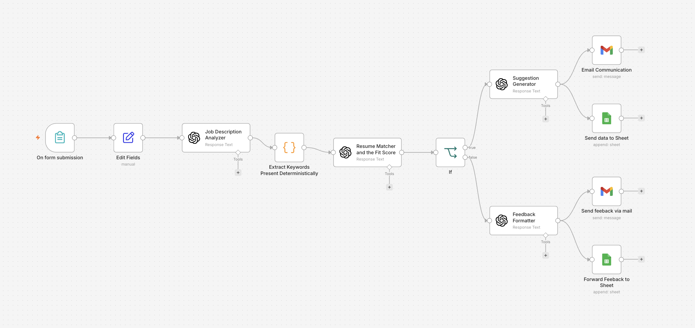
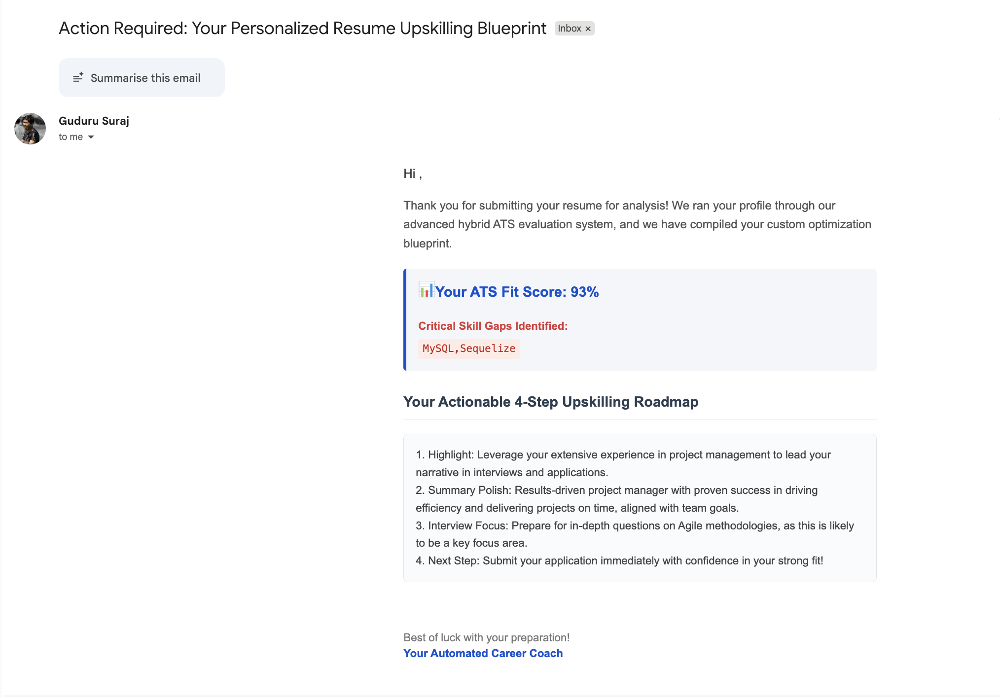
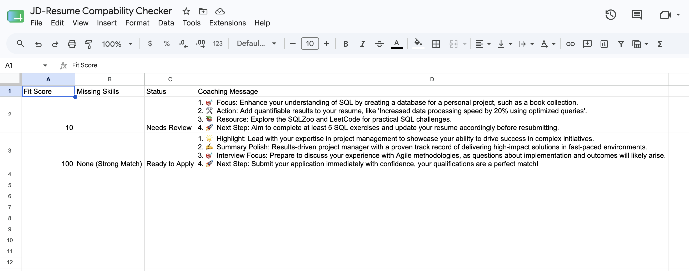
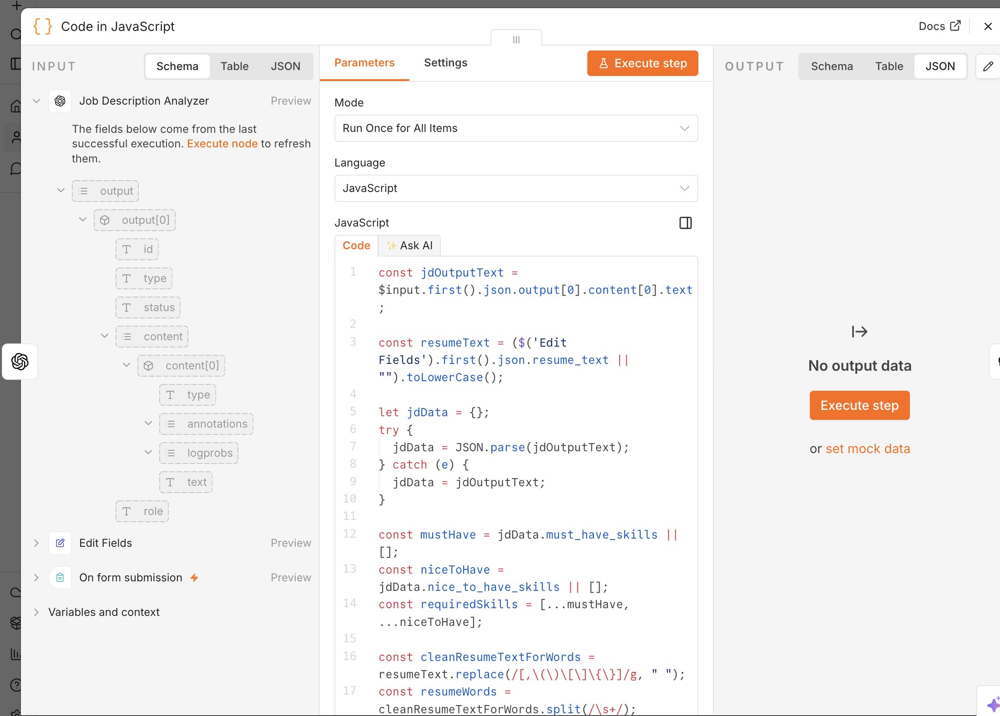

# Hybrid Intelligent ATS & Candidate Upskilling Workflow

A multi-step agentic pipeline built in n8n that processes candidate resumes against real-world Job Descriptions (JDs). The system combines rigid, deterministic algorithmic keyword matching with contextual AI semantic reasoning to grade alignment, log tracking metrics, and distribute customized, professional HTML coaching roadmaps.

## Project Walkthrough & Live Demo
[My Loom Submission Video](INSERT_YOUR_LOOM_VIDEO_URL_HERE)

---

## 1. Problem Statement

* **Target User:** Job Seekers, Career Counselors, and Recruitment Operations Teams.
* **The Core Pain Point:** Job seekers frequently submit applications without knowing how well their resume aligns with strict, automated corporate Applicant Tracking Systems (ATS). Generic AI resume evaluators often hallucinate scores or fail to detect technical nuances, leaving applicants without clear, structured, or actionable data on *how* to fix their specific skills gaps before officially applying.
* **Why It Matters:** Bridging this gap programmatically prevents candidates from receiving immediate automated rejections. It acts as an automated career coach, turning a passive evaluation into an active learning roadmap.
* **System Output:** 1. A structured baseline evaluation matrix pushed instantly to a centralized dashboard.
  2. Fully personalized, dynamically styled HTML email coaching blueprints routed to the candidate based on specific qualification thresholds.

---

## 2. Workflow Architecture Overview

### System Canvas Diagram


### The Core Pipeline Engine
The workflow processes incoming data through five critical structural phases:
[Form Ingestion] ➔ [JD Skill Extractor (AI)] ➔ [Token Normalizer (JS Code)] ➔ [Contextual Matcher (AI)] ➔ [Conditional Routing] ➔ [Dashboard & Email Delivery]

## 3. Node-by-Node Technical Breakdown (Use of AI vs. Deterministic Steps)

### Phase 1: Ingestion & Structural Analysis
* **Form Submission Trigger:** Captures raw, user-submitted candidate metadata (Name, Email) alongside the target Job Description text and full Candidate Resume context.
* **JD Analyzer (AI Node):** Acts as a structural metadata extractor. It parses the unformatted, text-heavy Job Description to extract a clean JSON schema identifying `must_have_skills` and `nice_to_have_skills`.

### Phase 2: Hybrid Evaluation Layer
This section highlights the advanced engineering of the pipeline, clearly segregating strict validation from semantic mapping.

#### Step A: Strict Deterministic Matching (Code Node - JavaScript)
* **Purpose:** To eliminate LLM scoring fluctuations and matching hallucinations by implementing code-driven keyword verification.
* **The Engineering Challenge:** Technical skills containing complex punctuation or symbols (e.g., `Node.js`, `CI/CD`) frequently fail basic tokenizers, which strip periods or slashes and result in false missing-skill flags.
* **The Solution:** A multi-layered regex pass preserves character punctuation boundaries while evaluating text across raw inclusion, word token arrays, and clean alphanumerics.

### Code Implementation Blueprint
```javascript
const cleanResumeTextForWords = resumeText.replace(/[,\(\)\[\]\{\}]/g, " ");
const resumeWords = cleanResumeTextForWords.split(/\s+/);
```

#### Step B: Contextual AI Semantic Reasoning (AI Agent Role: Reviewer/Planner)
* **Purpose:** Acts as a human-like operational reviewer. It anchors its absolute baseline onto the strict mathematical counts passed directly from the upstream JavaScript node (`$json.deterministic_keyword_score`), protecting the system's integrity.
* **AI Reasoning Capability:** If the JavaScript node flags a skill like *Prisma* as programmatically missing, the LLM scans the context for strong semantic equivalents (e.g., extensive experience with *Mongoose*, *Sequelize*, or raw SQL design). It applies a strict formula (+5 points per verified semantic match, capped at a maximum upward adjustment of +15 points) to ensure grading remains highly calibrated.

### Phase 3: Routing
* **Three-Way Conditional Routing (Deterministic - Switch Node):** Evaluates the final computed compatibility score:
  * **Score >= 75:** Auto-routed down the **Ready to Apply** track.
  * **Score < 75:** Auto-routed down the **Upskilling Track** for immediate blueprinting.

### Phase 4: Dynamic Operations & Communication Layer
* **Live Database Update (Google Sheets Node):** Tracks real-time operations by writing to a centralized `JD-Resume Compatibility Checker` spreadsheet, logging candidate name, email, baseline match scores, identified missing skills, and pipeline status.
* **Dynamic Communication Engines (Gmail Nodes):** Sends custom HTML notifications utilizing inline CSS. It injects a `white-space: pre-line` styling container alongside an internal `.replace()` chain to automatically isolate, break, and bold sequential list numbers (e.g., `1. Highlight:`, `2. Summary Polish:`) straight inside the user's inbox.

---

## 4. Structured Inputs & Outputs (Data Schema)

To maintain agentic determinism, the components exchange communication using strict JSON definitions:

### AI Extractor Output Schema
```json
{
  "extracted_metadata": {
    "job_title": "Senior Backend Engineer",
    "must_have_skills": ["Node.js", "PostgreSQL", "AWS Lambda", "CI/CD"],
    "nice_to_have_skills": ["GraphQL", "Docker"]
  }
}
```

### Sample Input:

#### JD:
Job Title: Senior Software Engineer (Full-Stack)

Location: Remote (US)

Experience Level: 4+ years

About the Role
We are looking for a Senior Full-Stack Software Engineer to join our core product team. In this role, you will help design, build, and scale our cloud-based SaaS platform. You will work closely with product managers and designers to deliver high-quality, user-centric features.

Key Responsibilities
Design and implement scalable web applications using React on the frontend and Node.js (TypeScript) on the backend.

Optimize application performance and migrate legacy services to a modern microservices architecture.

Design, build, and maintain RESTful APIs and integrate with PostgreSQL databases.

Collaborate with the DevOps team to manage CI/CD pipelines using GitHub Actions and deploy services on AWS.

Write clean, maintainable, and well-tested code (unit, integration, and end-to-end tests).

Requirements & Qualifications
4+ years of professional software engineering experience.

Strong proficiency in JavaScript, TypeScript, React, and Node.js.

Solid experience with relational databases (e.g., PostgreSQL, MySQL) and ORMs (e.g., Prisma, Sequelize).

Familiarity with cloud platforms, specifically AWS (S3, EC2, Lambda).

Experience working in an Agile/Scrum environment.

Excellent communication and problem-solving skills.

#### Resume: 

ALEX SMITH San Francisco, CA | alex.smith@email.com | (555) 019-2834

Professional Summary
Results-driven Full-Stack Software Engineer with over 4 years of experience designing, developing, and deploying scalable web applications. Proven track record in optimizing backend performance, migrating monolithic architectures to microservices, and building intuitive user interfaces. Strong expertise in TypeScript, React, Node.js, and AWS cloud solutions.

Technical Skills
Languages: JavaScript, TypeScript, Python, HTML5, CSS3, SQL

Frontend: React, Redux, Next.js, Tailwind CSS

Backend: Node.js, Express.js, GraphQL, REST APIs

Databases: PostgreSQL, MongoDB, Redis, Prisma ORM

DevOps & Tools: AWS (S3, EC2), Docker, GitHub Actions, Git, Jest, Agile/Scrum

Professional Experience
CloudTech Solutions – Software Engineer March 2024 – Present

Architected and developed core features for a B2B SaaS application using React and Node.js (TypeScript), improving user engagement by 25%.

Successfully migrated 4 legacy monolith services into standalone microservices, reducing system latency by 30%.

Designed complex database schemas in PostgreSQL and optimized slow-running queries, cutting API response times in half.

Led a team of 3 developers in an Agile environment to deliver an automated reporting tool 2 weeks ahead of schedule.

Innovate Web Labs – Full-Stack Developer June 2022 – February 2024

Built and maintained internal tools and customer-facing dashboards using JavaScript, React, and Express.js.

Configured CI/CD pipelines via GitHub Actions, reducing deployment errors by 40% and streamlining the release cycle.

Managed application deployments on AWS (EC2 and S3), ensuring 99.9% uptime.

Wrote comprehensive unit and integration tests using Jest, boosting total code coverage from 65% to 88%.

Education
Bachelor of Science in Computer Science State University, Graduated 2022

#### Email:
example@gmail.com

### Attaching Screenshots of the workflow and the results:




